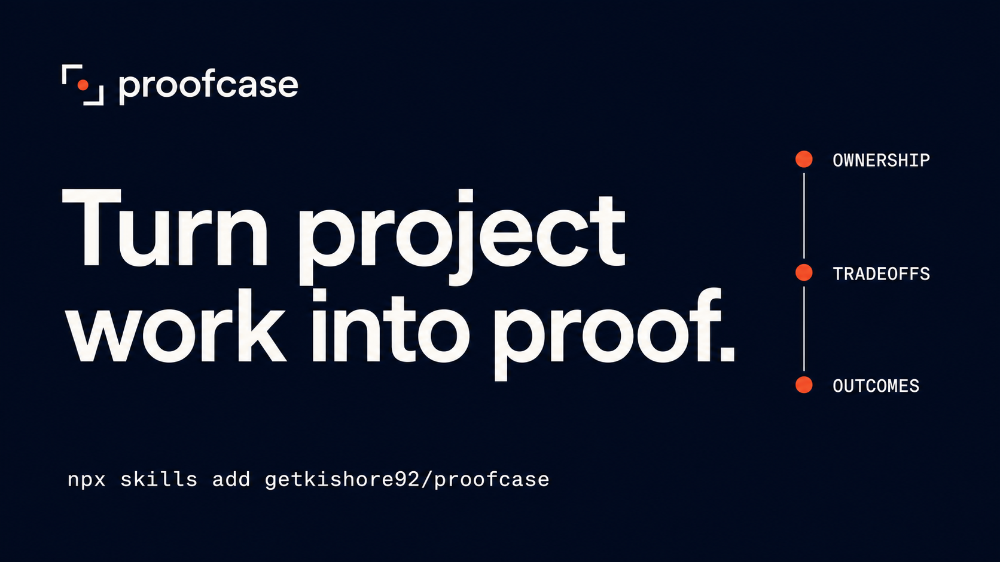

# Proofcase

[](https://skills.sh/getkishore92/proofcase/proofcase)



**Turn project work into a case study people can scan, trust, and discuss in an interview.**

## What this is

Proofcase audits, reconstructs, writes, and tailors portfolio case studies for product designers, UX researchers, product managers, software developers, and design engineers.

Give it a case study, project notes, screenshots, repository, presentation, or job description. It inspects the evidence, asks for material facts it cannot recover, and produces a clearer account without inventing research, ownership, or impact.

## Skill structure

```text
proofcase/
├── assets/
│   ├── launch/                     # Social launch cards
│   └── proofcase-cover.png         # README cover
├── skills/
│   └── proofcase/
│       ├── SKILL.md                # Core workflow
│       ├── agents/
│       │   └── openai.yaml         # Agent metadata and icons
│       ├── assets/                 # Installed logo and icon
│       └── references/
│           ├── examples.md         # Fictional before-and-after lessons
│           ├── industry-patterns.md
│           ├── intake-and-seniority.md
│           ├── narrative-and-evidence.md
│           ├── output-templates.md
│           ├── research.md
│           ├── scannability.md
│           └── rubric.md
├── README.md
├── THIRD_PARTY_NOTICES.md
└── LICENSE
```

## What Proofcase helps you do

- find the strongest story inside a messy project
- make ownership and team boundaries clear
- match the depth to junior, mid-level, senior, staff, lead, or manager roles
- tailor one case study to a specific job without changing the facts
- move final work and defensible outcomes closer to the top
- turn research, metrics, code, screenshots, and prototypes into evidence
- include failed bets, flat results, tradeoffs, and unresolved limits
- remove generic process sections and AI-sounding copy
- prepare a web case study, recruiter skim, or interview presentation
- anticipate the questions a hiring panel will ask
- rate the original and revised case with the same evidence-based scorecard
- measure AI and agent scannability without claiming an ATS success rate

## How it works

### Evidence before narrative

Proofcase builds a claim ledger for ownership, sources, confidence, outcomes, and counterevidence. Missing proof stays missing. Estimates remain estimates. Shared outcomes receive shared attribution.

### Match proof to the work

| Project type | Proofcase looks for |
|---|---|
| B2B | roles, permissions, complex workflows, integrations, adoption, operational change |
| B2C | segments, lifecycle, experiments, retention, monetisation, trust, localisation |
| Engineering | architecture, constraints, alternatives, testing, rollout, reliability, cost |
| Design engineering | prototypes, component APIs, states, motion, accessibility, shipped behaviour |
| Research | question quality, method limits, confidence, privacy, decision influence |
| Leadership | direction, leverage, team outcomes, influence, operating mechanisms |

### Support three reading speeds

The case study works at three reading speeds:

1. A fast scan shows what changed, what you owned, and the strongest proof.
2. A focused review explains the decisions, tradeoffs, and final work.
3. Interview depth preserves alternatives, metric caveats, edge cases, and lessons.

### Remove portfolio theater

Proofcase removes card sorts, personas, journey maps, workshop photos, and process diagrams when they do not explain a real decision. It does not fabricate participants, quotes, metrics, validation, shipped status, or causal impact.

### Use visual and interactive evidence

The skill helps select and caption images, prototypes, recordings, motion, live demos, diagrams, and code. It treats interaction and easter eggs as useful craft signals when they support the work and remain accessible.

### Measure improvement

Proofcase scores the original and completed revision on the same rubric. It reports an overall score, AI scannability, agent scannability, and the change between versions.

AI scannability checks whether an LLM can extract the role, ownership, decisions, evidence, outcomes, and limits without guessing. Agent scannability checks semantic structure, stable navigation, media labels, fallbacks, keyboard operation, and page metadata.

The rating describes the submitted case study. It does not predict an interview, ATS rank, or hiring decision. Planned edits do not receive points.

A completed rewrite returns a scorecard like this:

| Rating | Before | After | Change |
|---|---:|---:|---:|
| Proofcase score | 58 | 82 | +24 |
| AI scannability | 44 | 81 | +37 |
| Agent scannability | 56 | 88 | +32 |

These numbers illustrate the output format. Proofcase calculates the actual scores from the submitted versions.

## Install

Install with the Skills CLI:

```bash
npx skills add getkishore92/proofcase
```

The CLI supports Codex, Claude Code, Cursor, Windsurf, and other compatible agents. Installs contribute anonymous aggregate telemetry to the [skills.sh listing](https://skills.sh/getkishore92/proofcase/proofcase).

You can clone the repository and copy its skill package into an agent-specific directory:

```bash
git clone https://github.com/getkishore92/proofcase.git

# Codex
cp -R proofcase/skills/proofcase ~/.codex/skills/proofcase

# Claude Code
cp -R proofcase/skills/proofcase ~/.claude/skills/proofcase
```

Restart the agent if it does not detect the skill.

For agents without Skills CLI support, load `skills/proofcase/SKILL.md` as project knowledge or include it in the system prompt. Load reference files when the task needs them.

## Use

Audit an existing case study:

```text
Use $proofcase to audit this case study for a senior product designer role: [URL or file]
```

Build from raw material:

```text
Use $proofcase to turn these notes, screenshots, and project files into a web case study. Ask me for facts you cannot verify.
```

Tailor to a role:

```text
Use $proofcase to tailor my existing case study to this job description without changing the facts.
```

Prepare an interview:

```text
Use $proofcase to convert this case study into a 20-minute presentation and identify the questions I need to defend.
```

Improve an engineering case study:

```text
Use $proofcase to rewrite this engineering project around architecture decisions, constraints, rollout, reliability, and measurable product impact.
```

## What you receive

A full run can produce:

1. target role and seniority assessment
2. evidence and ownership gaps
3. a revised case-study structure
4. publishable copy with visual directions and captions
5. a record of the important changes
6. likely interview questions and weak points
7. overall, AI-scannability, and agent-scannability ratings with before-and-after deltas
8. optional recruiter, web, presentation, and job-specific versions

The bundled [examples](skills/proofcase/references/examples.md) use fictional composites to demonstrate stronger B2B, B2C, research, engineering, design-engineering, AI-product, and leadership case studies. Every invented fact is labeled and exists for teaching.

## What it catches

- **Generic process:** methods listed without a decision they changed
- **Inflated ownership:** shared delivery written as solo work
- **Metric spin:** positive numbers without baselines, time windows, regressions, or caveats
- **Fake research:** invented participants, personas, quotes, validation, or findings
- **Buried work:** final designs, prototypes, code, and outcomes placed after long setup
- **Weak visual proof:** screenshot galleries without annotations or useful captions
- **Seniority mismatch:** execution framed as strategy, or leadership described without team leverage
- **AI theater:** tool lists without verification, judgment, or a traceable result
- **Success theater:** every decision works and no limitation survives launch
- **Synthetic copy:** filler, vague claims, repetitive rhythm, and stock case-study language
- **AI extraction gaps:** ambiguous ownership, undefined terms, unsupported claims, and visual-only evidence
- **Agent access gaps:** weak semantics, missing labels, fragile interactions, and content hidden behind scripts or media

## Why this exists

AI can produce fluent prose, process diagrams, interface concepts, and polished mockups in minutes. Hiring teams still need to identify the candidate's contribution and judgment. A useful case study shows the decision, evidence, shipped result, cost, and follow-up.

Proofcase treats the portfolio as evidence for a hiring conversation. It cannot guarantee an interview or job.

## Research and credits

The workflow draws on current portfolio and skills-based hiring research listed in [skills/proofcase/references/research.md](skills/proofcase/references/research.md).

The narrative guidance responds to Fabricio Teixeira's critique in [The case study factory](https://essays.uxdesign.cc/case-study-factory/): repeated process templates can hide the judgment a case study should reveal.

The copy review adapts principles from [stop-slop](https://github.com/hardikpandya/stop-slop) by Hardik Pandya under the MIT License. See [THIRD_PARTY_NOTICES.md](THIRD_PARTY_NOTICES.md).

## License

MIT. See [LICENSE](LICENSE).
